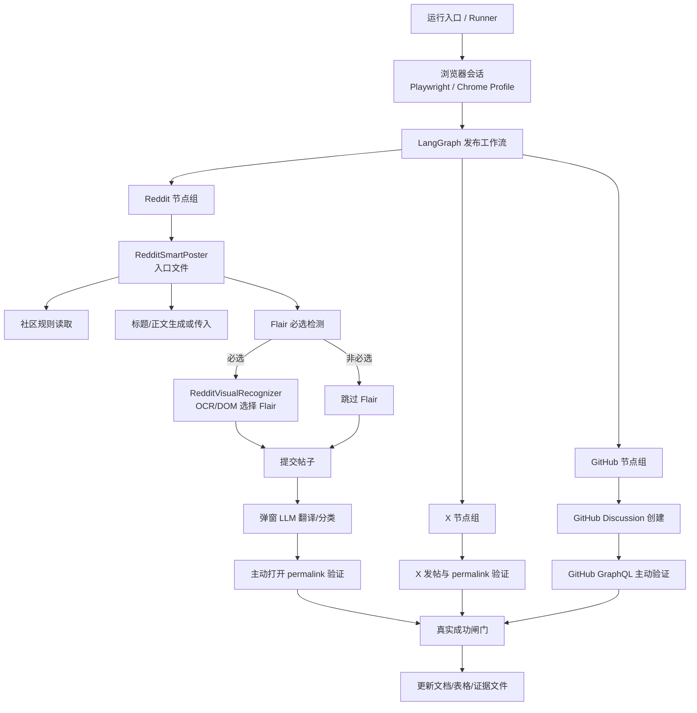

# 社交发布架构文档

## 文档用途

说明 X / Reddit / GitHub 社交发布系统的模块边界、数据流和真实性验证闸门。

## 主要职责

- 描述浏览器、LangGraph、LLM、OCR、GitHub GraphQL API、验证器之间的关系。
- 标明入口文件和关键依赖。
- 说明成功证据如何产生和被拒绝。

## 不负责

- 不记录平台账号凭据。
- 不提供绕过平台限制的方案。
- 不把测试夹具或截图单独作为真实发帖成功证明。

## 总体架构

## 模块边界

### 1. 浏览器层

职责：

- 提供真实 browser page。
- 维护登录态。
- 执行页面导航、点击、输入、截图。

边界：

- 不解释社区规则。
- 不判断发帖是否真实成功。

### 2. 编排层

职责：

- 使用 LangGraph 拆分节点。
- 维护状态、重试次数、错误原因、证据链。
- 决定失败后是否进入修正节点。

边界：

- 不直接伪造内容或成功状态。
- 不绕过下游验证器。

### 3. 认知层

职责：

- 使用激活态 LLM 翻译和理解 Reddit 弹窗。
- 根据社区规则生成标题和正文。
- 对错误提示给出可执行修正建议。

边界：

- LLM 调用失败时必须 fail-closed。
- 不允许用规则链冒充 LLM 输出。

### 4. 执行层

职责：

- RedditSmartPoster 打开发帖页、填写内容、检查 Flair、提交。
- RedditVisualRecognizer 处理视觉识别、Flair 弹窗、提交后页面反馈。
- GitHubSmartPoster 调用 GitHub GraphQL API 创建 Discussion 并读回验证。

边界：

- 不把按钮点击成功当作发帖成功。
- 不把弹窗“看起来成功”当作最终证据。

### 5. 验证层

职责：

- 校验 post_url 形态。
- 主动打开 permalink。
- 校验页面正文包含预期标题/内容。
- 写入结构化 evidence。
- GitHub 使用 GraphQL 读回 Discussion 做 read-after-write 验证，不依赖浏览器页面推断。

边界：

- 不能用截图替代 permalink。
- 不能用示例 URL 替代真实发帖结果。

## 成功证据标准

Reddit 成功必须同时满足：

- `success=True`
- `post_url` 是目标 subreddit 的 Reddit permalink
- `trace_id` 存在
- `verified_at` 存在
- `verification_source=active_browser_permalink_open`
- 主动打开 permalink 后页面正文包含预期标题

X 成功必须同时满足：

- `success=True`
- `post_url` 是 X/Twitter status URL
- `trace_id` 存在
- `verified_at` 存在
- 主动打开 permalink 后页面正文包含预期内容

GitHub 成功必须同时满足：

- `success=True`
- `post_url` 是 `https://github.com/{owner}/{repo}/discussions/{number}`
- `trace_id` 存在
- `verified_at` 存在
- `verification_source=github_graphql_discussion_get`
- 创建后 GraphQL 读回同一个 Discussion
- GraphQL 响应中的标题和正文匹配预期内容

## 回滚路径

- 代码回滚：恢复 `Agent/social_promotion/reddit_smart_poster.py` 和相关调用方到上一个 git 版本。
- 文档回滚：删除或恢复 `Agent/docs/social_posting/` 下新增文档。
- 运行状态回滚：不要手动写入 `Agent/data/real_posting_success_evidence.json`；如真实测试发帖成功但内容不应保留，需要到平台手动删除对应 X/Reddit 帖子或删除 GitHub Discussion。
