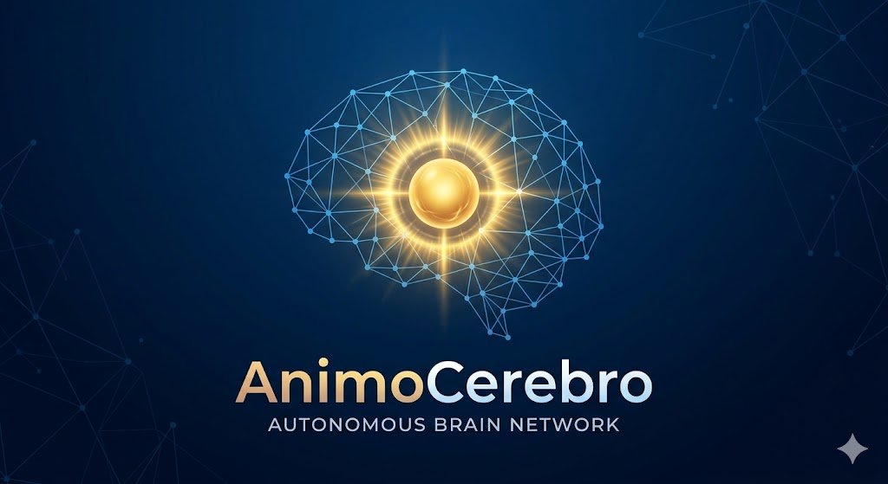

# AnimoCerebro

[Chinese README](README.zh.md)

## Overview

AnimoCerebro is the brain layer for agents and host systems. It is responsible for reasoning, role inference, goal generation, risk assessment, memory accumulation, delegation advice, and long-term experience exchange. It is not a forced executor, not a default reply engine, and not a replacement for an existing host architecture.

## What It Is

AnimoCerebro is built around a nine-question cognitive loop:

1. Where am I
2. Who am I
3. What do I have
4. What can I do
5. What am I allowed to do
6. What else can I do
7. What should I not do even if I can
8. What should I do
9. How should I do it

## Positioning

Use AnimoCerebro as:

- a brain layer for one agent
- an advisory sidecar for an existing system
- a coordination brain for multi-agent environments
- an external brain attached to a host such as OpenClaw

Do not treat it as:

- a mandatory customer-facing reply engine
- a hard takeover layer
- a reason to rewrite a working host architecture

## Current Protocol

The current public protocol is no longer a single `Z-JSON` packet. It is now a layered protocol for registration, capability discovery, delegation, receipts, escalations, experience exchange, and host adaptation.

Primary protocol docs:

- [Protocol Overview](当前对接协议.md)
- [Core Foundations](docs/architecture/CORE_FOUNDATIONS.md)
- [Help Guide](帮助文档.md)
- [Deployment And Integration](详细部署与集成说明.md)

## Documentation Map

- [Technical Whitepaper (EN)](WHITEPAPER.md)
- [技术白皮书 (ZH)](技术白皮书.md)
- [Quick Start](快速开始-复制即用.md)
- [Deployment And Integration](详细部署与集成说明.md)
- [Single-Prod Docker](docs/operability/SINGLE_PROD_DOCKER.md)
- [Cluster-Core Docker](docs/operability/CLUSTER_CORE_DOCKER.md)
- [Core Foundations](docs/architecture/CORE_FOUNDATIONS.md)
- [Cognitive Tool Interface](docs/architecture/COGNITIVE_TOOL_INTERFACE.md)
- [OpenClaw Host Adapter Protocol](docs/integrations/OPENCLAW_HOST_ADAPTER_PROTOCOL.md)
- [OpenClaw Integration Guide](docs/integrations/OPENCLAW_INTEGRATION_GUIDE.md)
- [Public Release Checklist](docs/operability/PUBLIC_RELEASE_CHECKLIST.md)
- [GitHub Public Scope](docs/operability/GITHUB_PUBLIC_SCOPE.md)
- [Public Git Add Commands](docs/operability/PUBLIC_GIT_ADD_COMMANDS.md)
- [Help Guide](帮助文档.md)
- [Short Help Entry](helo.md)
- [Testing Guide](测试文档.md)

## Integration Model

AnimoCerebro is designed for minimal intrusion.

- Your host keeps its own execution architecture.
- AnimoCerebro provides reasoning, memory, coordination, and audit.
- The adapter layer registers the host, syncs capabilities, receives delegated work, and writes back results.

## Current Capabilities

- Brain loop
- Resident and daemon modes
- Local cloud-audit service
- Web console
- Long-term memory via JSONL or SQLite
- Delegation, receipt, escalation, and experience exchange
- Host adapter support for OpenClaw

## Truthfulness Boundary

For any product path that claims to use an LLM, AnimoCerebro does not allow rule-based logic, template assembly, fixed samples, fake transports, stubbed completions, or any code that only pretends to call an LLM to stand in for the real live LLM path.

If a feature requires a live LLM, the live call must actually happen. When credentials, network, provider health, or response validity fail, the system must fail or degrade truthfully and label the result as non-live or non-real where applicable.

The same standard applies to testing: any test that does not execute the real project logic under test is invalid and forbidden. Mocks or stubs may isolate external dependencies, but they cannot replace the product's own core logic and still be counted as proof.

## Install

Recommended: Python 3.11+

```bash
bash scripts/start.sh
```

Manual install:

```bash
python -m venv .venv
source .venv/bin/activate
pip install -e .[dev]
```

CLI:

- `animocerebro`

## LLM Providers

`animocerebro_vision.yaml` now supports these `llm.provider` values:

- `google`: Gemini, default env `GOOGLE_API_KEYS`
- `openai` or `openapi`: OpenAI-compatible chat completions, default env `OPENAI_API_KEY`
- `anthropic` or `claude`: Claude Messages API, default env `ANTHROPIC_API_KEY`

You can now configure keys in three normal ways:

1. Directly in the config file
2. Via a local `credentials_file`
3. Via environment variable as a compatibility path

Example:

```yaml
llm:
  provider: gemini
  model: gemini-3.1-flash-lite-preview
  api_keys:
    - your-key-here
```

Or:

```yaml
llm:
  provider: gemini
  model: gemini-3.1-flash-lite-preview
  credentials_file: .animocerebro/llm_keys.json
```

Where `.animocerebro/llm_keys.json` may contain either:

```json
{"api_keys": ["your-key-here"]}
```

or:

```json
{"api_key": "your-key-here"}
```

## Quick Start

Start with zero arguments:

```bash
animocerebro
```

Run one cycle:

```bash
animocerebro run --state-dir .animocerebro/state --config animocerebro_vision.yaml --pretty
```

Run resident mode:

```bash
animocerebro run --state-dir .animocerebro/state --config animocerebro_vision.yaml --resident --interval 60
```

Start the web console:

```bash
animocerebro web start --state-dir .animocerebro/state --config animocerebro_vision.yaml --host 127.0.0.1 --port 8899
```

Frontend hot reload:

```bash
bash scripts/web-dev.sh
```

## OpenClaw

OpenClaw is currently the first implemented host adapter. The adapter does not take over OpenClaw. It registers OpenClaw to AnimoCerebro, syncs host capabilities and runtime state, receives delegated work, and writes back receipts, escalations, and experience.

The web console can display and copy the currently configured OpenClaw bridge token from the local AnimoCerebro process.

See:

- [Protocol Overview](当前对接协议.md)
- [OpenClaw Integration Guide](docs/integrations/OPENCLAW_INTEGRATION_GUIDE.md)
- [OpenClaw Host Adapter Protocol](docs/integrations/OPENCLAW_HOST_ADAPTER_PROTOCOL.md)
- [OpenClaw Host Adapter Architecture](docs/integrations/OPENCLAW_HOST_ADAPTER_ARCHITECTURE.md)

## Repository Structure

- `src/zentex`: core backend and services
- `src/studio`: web frontend
- `integrations/`: adapters such as OpenClaw
- `tests/`: automated tests
- `scripts/`: bootstrap, development, and real-check scripts
- `docs/`: operability and design docs

## Next Reading

- [Technical Whitepaper (EN)](WHITEPAPER.md)
- [技术白皮书 (ZH)](技术白皮书.md)
- [Quick Start](快速开始-复制即用.md)
- [Deployment And Integration](详细部署与集成说明.md)
- [Help Guide](帮助文档.md)
- [Protocol Overview](当前对接协议.md)
